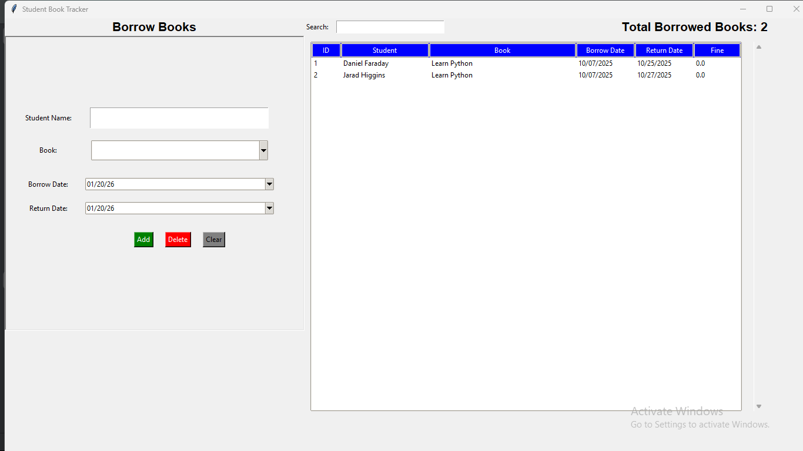

# Library Management System (SQL & Python)

This project is a simple **library management system** built to practice working with **SQL, SQLite, and Python**, along with basic user interface development using **Tkinter**.

The application allows tracking of books, borrowed records, and overdue fines using a relational database.

---

## Features
- Store and manage books in a **SQLite relational database**
- Track borrowed books and student borrowing records
- Automatically calculate **overdue fines** based on return dates
- Update book availability when books are borrowed or returned
- Search and display borrowing records through a graphical interface
- Highlight overdue records with outstanding fines

---

## Database Design

The system uses two main tables:

### `Books`
| Column | Description |
|------|------------|
| id | Unique book identifier |
| title | Book title |
| quantity | Available copies |

### `Borrowed_books`
| Column | Description |
|------|------------|
| id | Borrow record ID |
| student_name | Name of the student |
| book_id | Reference to the borrowed book |
| borrow_date | Date the book was borrowed |
| return_date | Expected return date |
| fine | Calculated overdue fine |

The tables are linked using a **foreign key relationship** between `Borrowed_books.book_id` and `Books.id`.

---

## Technologies Used
- **Python**
- **SQL**
- **SQLite**
- **Tkinter**
- `sqlite3`, `datetime`, `tkcalendar`

---

## How It Works
1. Books are stored in a SQLite database with available quantities.
2. When a student borrows a book:
   - A record is added to the `Borrowed_books` table
   - The book quantity is reduced
3. If a book is returned late:
   - The system calculates the overdue days
   - A fine is applied automatically
4. Borrowed records are displayed in a table-based UI.
5. Overdue records with fines are visually highlighted.

---

---

## Screenshots

---

## Purpose of the Project
This project was created as a **learning-focused exercise** to:
- Practice **SQL querying and relational database design**
- Integrate **Python with a SQL database**
- Apply business logic such as date handling and fine calculation
- Build a simple interface to visualize and manage structured data

---

## Future Improvements
- User authentication
- Book reservation system
- Export borrowing data for analysis
- Improved UI/UX design

---

## 📄 License
This project is for educational purposes.
#   L i b r a r y - M a n a g e m e n t - S y s t e m 
 
 

